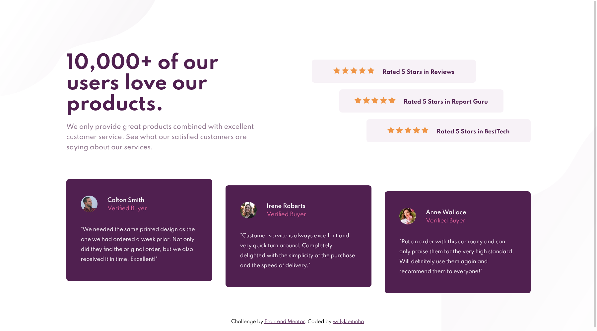

# Frontend Mentor - Social proof section solution

This is a solution to the [Social proof section challenge on Frontend Mentor](https://www.frontendmentor.io/challenges/social-proof-section-6e0qTv_bA). Frontend Mentor challenges help you improve your coding skills by building realistic projects. 

## Table of contents

- [Overview](#overview)
  - [The challenge](#the-challenge)
  - [Screenshot](#screenshot)
  - [Links](#links)
- [My process](#my-process)
  - [Built with](#built-with)
  - [What I learned](#what-i-learned)
  - [Useful resources](#useful-resources)
- [Author](#author)

## Overview

### The challenge

Users should be able to:

- View the optimal layout for the section depending on their device's screen size

### Screenshot

### Links

- Solution URL: [on Frontend Mentor](https://www.frontendmentor.io/solutions/simple-grid-layout-css-and-html-LN3EN_Xyu)
- Live Site URL: [on Github Pages](https://willykleitinho.github.io/social-proof-section/)

## My process

### Built with

- CSS custom properties
- CSS Grid
- Mobile-first workflow

### What I learned

In this project, I practiced CSS organization and structuring, Grid, and mobile-first workflow.

### Useful resources

- [A Complete guide to Grid - CSS Tricks](https://css-tricks.com/snippets/css/complete-guide-grid/) - This has helped me to understand CSS Grid better.

## Author

- Github - [willykleitinho](https://github.com/willykleitinho)
- Frontend Mentor - [@willykleitinho](https://www.frontendmentor.io/profile/willykleitinho)
